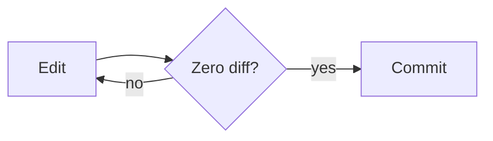

# Keep Mode Demo

This file is for testing the **EasyMarkdown Keep** custom editor. Open it, then
run **Reopen Editor With… → EasyMarkdown Keep**.

## Inline editing

Double-click this paragraph (or hover and click the pencil) to edit its source.
Try **bold**, *italic*, `inline code`, and a [link](https://example.com).

## Table (double-click a cell to edit, ▼ to filter, right-click for row/col ops)

| Name    | Role      | Status |
| ------- | --------- | ------ |
| Alice   | Engineer1 | Active |
| Bob     | Designer  | Away   |
| Carol   | Engineer  | Active |

## Mermaid

## Math

$$
E = mc^2
$$

## Image (relative path resolves via asWebviewUri)

